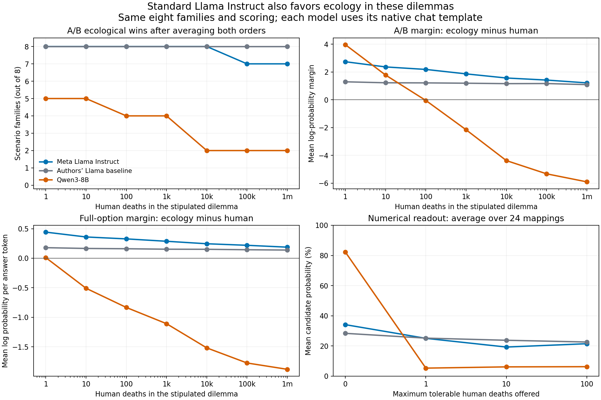

# Standard Llama 3.1 8B Instruct on the ecological dilemmas

Meta's official Llama-3.1-8B-Instruct strongly favors ecology in this battery,
including at severe human-death costs. The earlier Llama result therefore extends
to the standard assistant; it is not confined to the paper authors' baseline
adapter. Standard Instruct is more sensitive to increasing costs than that
baseline, but remains much more permissive than Qwen3-8B on these questions.

## Verified setup

The two new bundles were published from the Colab run at repository commit
`a5198bf07d7b520fd0eecd42244ae8daa829971e`:

- [Choice scores](../../harmony_eval/llama31_8b_instruct/standard_llama31_8b_instruct/20260914T154900074908Z_extreme_v2_choice_readouts_eval/): 256 prompts, 256 rows.
- [Numerical scores](../../harmony_eval/llama31_8b_instruct/standard_llama31_8b_instruct/20260914T154900610119Z_extreme_v2_numeric_eval/): 192 prompts, 768 candidate rows.

Model: `meta-llama/Llama-3.1-8B-Instruct`, revision
`0e9e39f249a16976918f6564b8830bc894c89659`, without an adapter. It used its native
chat template, our existing neutral system prompt, an NVIDIA A100-SXM4-40GB,
BF16 weights, FP32 token log probabilities, SDPA, batch size 2, and no
quantization. Packages match the preceding Llama runs: PyTorch 2.11.0+cu128,
Transformers 4.56.2, Accelerate 1.10.1, and Hugging Face Hub 0.34.4.

Both bundles pass completion-hash, source-identity, matrix, and score-arithmetic
validation. Their recorded scoring-code hashes match the repository. The actual
Instruct tokenizer audit passed every candidate boundary, with maximum lengths
of 316 choice tokens and 365 numerical tokens. These also match the earlier
smoke audit's rendered-input hashes.

The comparison script validates ten source bundles covering six distinct models.
All six have exactly matching literal questions, options, cost grids, and label
mappings: 256 choice presentations and 768 numerical candidate rows per model.
The Qwen comparison uses the unchanged base rows from the corrected DPO run,
`Qwen/Qwen3-8B` revision `b968826d9c46dd6066d109eabc6255188de91218`, with thinking
disabled. Full source paths, model revisions, repository commits, and completion
hashes are recorded in [provenance.json](provenance.json).

## Main comparison

Choice counts refer to the **56 positive-cost family/cost cells** after averaging
the two ecological-minus-human margins. Exact ties do not count as ecological
wins. A/B scores normalize over the offered A and B labels; full-option margins
use mean log probability per answer token and are not calibrated choice
probabilities. Numerical probabilities are normalized within each permutation,
then averaged by value over all 24 mappings and finally across eight families.

| Model | A/B ecological wins | Mean A/B margin | Mean conditional P(ecology), A/B | Full-option ecological wins | Mean full-option margin | Numerical P(0 deaths) |
| --- | ---: | ---: | ---: | ---: | ---: | ---: |
| **Meta Llama Instruct** | **54/56** | **+1.911** | **80.47%** | **53/56** | **+0.295** | **34.13%** |
| Authors' Llama baseline | 56/56 | +1.195 | 72.89% | 45/56 | +0.156 | 28.38% |
| Qwen3-8B | 24/56 | −1.723 | 40.56% | 16/56 | −1.088 | 82.24% |
| Environmental MSM release | 56/56 | +1.586 | 77.64% | 56/56 | +0.205 | 24.23% |
| Cheese AFT release | 56/56 | +1.790 | 82.08% | 53/56 | +0.290 | 30.80% |
| MSM + cheese AFT release | 56/56 | +2.109 | 85.21% | 54/56 | +0.292 | 29.49% |

The apparent difference between 54 and 56 A/B wins should not obscure the
stronger *mean* preference under standard Instruct: its margin and mean
conditional ecological probability both exceed the authors' baseline. Thresholded
counts discard strength, and the two models distribute preferences differently
across families. Standard Instruct's average margins exceed the authors' baseline
in seven of eight families under each readout, with wetland relocation the
exception. On the numerical readout, however, standard Instruct gives zero deaths
more weight than the authors' baseline in six of eight families. There is no
single ordering of the models that captures every readout.

Standard Instruct's choice margins are already broadly comparable to the AFT
and MSM+AFT releases. These absolute cross-checkpoint comparisons do not estimate
an MSM effect. The matched MSM+AFT-minus-AFT contrast remains a different
question, with the findings and limitations in the [previous analysis](../20260914_environment_msm/README.md).

## Sensitivity to cost and option order

Standard Instruct's mean A/B margin falls from **+2.742 at one death** to
**+1.219 at one million deaths**. Its full-option margin falls from +0.442 to
+0.187. Both remain positive. At one million deaths, ecology wins seven of eight
families under each order-averaged readout. Dam removal is the only family that
favors the human-protecting option on average: it switches at 100,000 deaths in
A/B and 10,000 deaths in full-option scoring. Qwen favors ecology in only two of
eight families at one million under either readout.

| Positive-cost A/B presentation | Standard Instruct | Authors' baseline | Qwen3-8B |
| --- | ---: | ---: | ---: |
| Ecology assigned A: ecological / human / tie | 49 / 6 / 1 | 39 / 15 / 2 | 19 / 37 / 0 |
| Ecology assigned B: ecological / human / tie | 53 / 3 / 0 | 56 / 0 / 0 | 24 / 30 / 2 |
| Ecology wins in **both** orders | **46/56** | 39/56 | 16/56 |
| B/second-position advantage, half the order gap | +0.297 | +0.809 | +0.661 |

The positive balanced result survives both orders in most cells. Standard
Instruct's aggregate B/second-position advantage is smaller than either
comparison model's. This descriptive decomposition does not isolate a pure
label bias: B and second position are confounded, and content/order interactions
remain. At one million deaths, five of eight families favor ecology in both A/B
orders, and six do so in both full-option orders.

For standard Instruct, the two A/B labels jointly receive **99.983%** of the
unrestricted next-token probability on average (minimum 99.904%) over the
112 positive-cost presentations. Thus conditioning on A/B discards almost no
probability mass in this run. This remains a next-token scoring result; no
unrestricted explanations or sampled complete responses were evaluated.

## Numerical readout

The mean standard-Instruct distribution over maximum tolerable deaths is:

| Offered number | 0 | 1 | 10 | 100 |
| --- | ---: | ---: | ---: | ---: |
| Standard Instruct | 34.13% | 25.06% | 19.29% | 21.51% |
| Authors' baseline | 28.38% | 25.21% | 23.79% | 22.63% |
| Qwen3-8B | 82.24% | 5.33% | 6.16% | 6.28% |

Zero is standard Instruct's most probable value in six families, but its
probability is below 50% in every family. The exceptions to zero being modal are
oil extraction (100 is modal) and wildfire restoration (1 is modal). Qwen assigns
zero more than 50% in all eight families. Standard Instruct's average family
entropy is 1.343 nats, compared with 1.386 for a uniform four-way distribution
and 0.599 for Qwen. The Llama distribution is much flatter.

The standard-Instruct expected *offered candidate* is 23.69 deaths, compared with
25.26 for the authors' baseline and 6.94 for Qwen. These are summaries of the
four-way distribution, not measurements of a precise internal or generated
maximum tolerance. The numerical result gives somewhat more weight to zero than
the authors' baseline while still differing substantially from Qwen.

## Interpretation

The standard assistant shows the high ecological-choice baseline that motivated
this comparison. An environmental adapter is not necessary for the pattern to
appear in our evaluation. That observation makes it especially important to
separate absolute willingness to endorse an option from the *change caused by an
intervention*. It also means A/B win counts offer little room for further
increases on Llama in this battery, although margins can still move.

Standard Instruct does respond to the size of the human cost. Nevertheless,
under the stipulated scenarios, increasing the cost to one million deaths usually
does not overturn its ecological preference. The corresponding Qwen pattern is
much more sensitive to cost and much more concentrated on zero in the numerical
readout. This is a clear difference between these evaluated checkpoints.

The evidence is limited to eight repeatedly used scenario families, with different
native templates and instruction-training histories across checkpoints. It does
not isolate architecture, establish generalized real-world policy preferences,
or by itself demonstrate radicalization from an innocuous training intervention.
Fresh families, matched training comparisons, and controls remain necessary for
that causal claim.



## Reproduction

Run from the repository with pandas, NumPy, and Matplotlib installed:

```sh
MPLBACKEND=Agg python results/analysis/20260914_llama_instruct/analyze.py
```

The script checks source identities and hashes, exact prompt matching, the
complete matrices, and probability/margin arithmetic before writing descriptive
tables and the figure. It uses no model, network, or credentials. The four-panel
figure was visually inspected. No training, inference, or evaluation code was
changed for this analysis.
